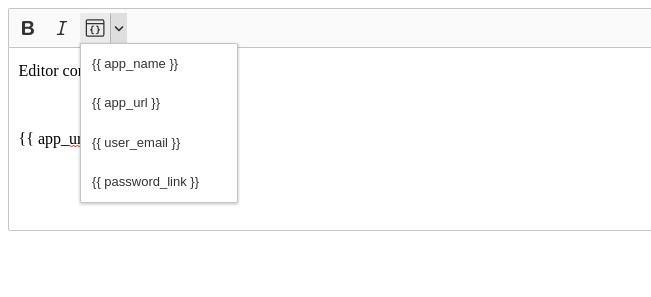

# Dynamic text plugin for CK Editor 5

A CK Editor 5 plugin which adds a button allowing users to insert labels for content to be replaced with dynamic text


## Instructions

1. Install the npm package

```bash
npm install @pango-studio/ckeditor_dynamic_text
```

2. Add the plugin and configuration to your CK editor instance
```js
import InsertDynamicText from '@pango-studio/ckeditor_dynamic_text/src/wproofreader';
...

ClassicEditor
	.create( editorElement, {
		plugins: [ ..., InsertDynamicText],
		toolbar: [ ..., 'InsertDynamicText'],
		dynamicTextOptions: {
            labels: ['app_name', 'app_url', 'user_email', 'password_link'],
        },
	})
```
